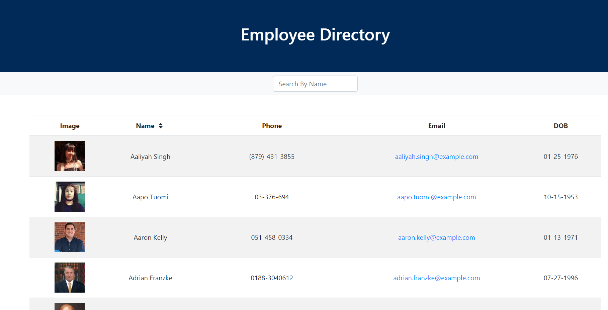

# [Employee-Directory](https://https://tomxli.github.io/employee-directory//)

<h1>User Story</h1>

* As a user, I want to be able to view my entire employee directory at once so that I have quick access to their information.

<h1>Business Context</h1>

An employee or manager would benefit greatly from being able to view non-sensitive data about other employees. It would be particularly helpful to be able to filter employees by name or sort by name order.

<h1>Tech Stack:</h1>
<li>React Documentation - (https://reactjs.org/docs/getting-started.html)</li>
<li>Random User Generator API - (https://randomuser.me/documentation)</li>
<li>Bootstrap - (https://getbootstrap.com/docs/4.4/getting-started/introduction/)</li>

<h1>Github Pages Link:</h1>
https://https://tomxli.github.io/employee-directory/

